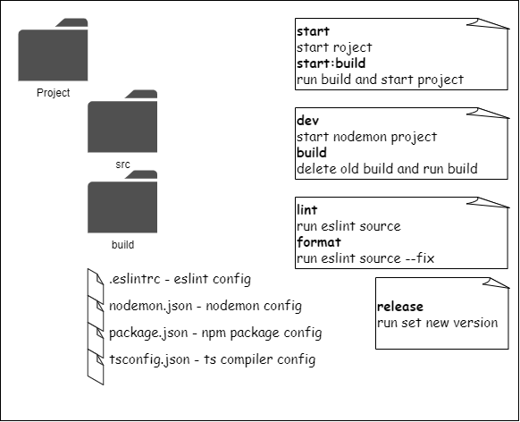

# ts-simple-template

## Tools

[ESlint](https://eslint.org/) - static code analyzer

[nodemon](https://nodemon.io/) - automatically restart on code change

[TypeScript](https://www.typescriptlang.org/) - it is JS with syntax for
types.

